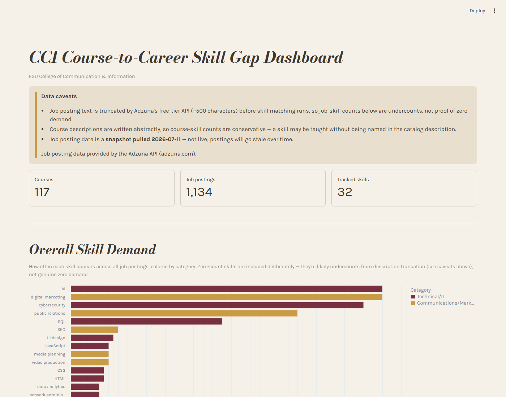
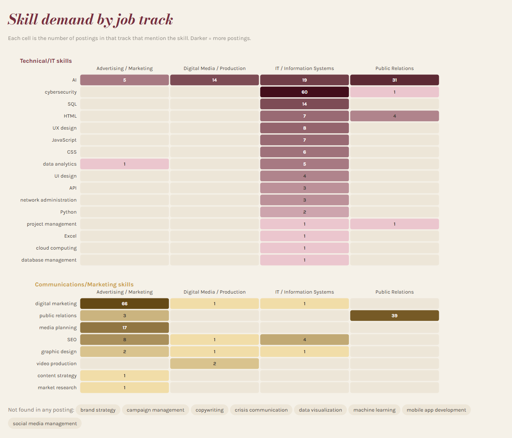

# CCI Course-to-Career Skill Gap

What does FSU's College of Communication & Information actually teach, and
what do entry-level employers actually ask for? This project compares all
117 CCI undergraduate course descriptions against 1,134 real job postings
to find where the two line up and where they don't.

**Live dashboard:** https://course-to-career-skill-gap.streamlit.app



> This is an independent student data analysis project. It is not
> affiliated with, endorsed by, or produced by Florida State University or
> the College of Communication & Information.

## Key findings

1. **AI is the most in-demand skill, but only one course names it.**
   "AI" appeared in 66 postings, more than any other skill, and showed up
   in all four job tracks. Only one CCI course (LIS 4376, Artificial
   Intelligence Applications) mentions it. AI is also the strongest finding
   here, because it was *not* one of the job search terms (see Limitations).

2. **SQL is close behind.** SQL appeared in 32 postings, almost all in IT
   roles, and only one course description names it (LIS 3781, Advanced
   Database Management).

3. **Web skills appear in IT postings, but no course names them.**
   JavaScript (8), HTML (7), CSS (7) and Python (5) all appear in IT postings
   and match zero course descriptions.

4. **The School of Information covers most of the in-demand skills.**
   Of the 27 skills that appeared in at least one posting, School of
   Information courses cover 9. School of Communication courses cover 3
   (graphic design, public relations, video production), even though the
   School of Communication has more than twice as many courses (80 vs. 37).

5. **A surprise:** social media management, which sounds like
   Communication territory, is taught in the School of Information
   (LIS 4380, Social Media Management).



## How it works

```
FSU course catalog ─┐
                    ├─► tag_skills.py ─► build_database.py ─► analyze.py ─► dashboard.py
Adzuna job API ─────┘   (keyword match)   (SQLite)            (gap SQL)     (Streamlit)
```

1. **Collect.** Course descriptions come from FSU's public course catalog.
   Job postings come from the [Adzuna API](https://developer.adzuna.com/)
   (`fetch_jobs.py`), using 19 entry-level search terms grouped into four
   tracks: Advertising / Marketing, Digital Media / Production,
   IT / Information Systems and Public Relations.
2. **Tag.** `tag_skills.py` matches every course and posting against one
   shared list of 32 skills (whole-word, case-insensitive).
3. **Store.** `build_database.py` loads everything into a SQLite database
   with five tables. `make_public_db.py` then makes the published copy
   (`cci_pipeline_public.db`), which drops the Adzuna posting text, titles,
   companies and links and keeps only what the analysis needs.
4. **Analyze.** `analyze.py` holds the gap-analysis SQL queries. The
   dashboard reuses the same queries, so the numbers always match.
5. **Show.** `dashboard.py` is a Streamlit + Altair dashboard styled in FSU
   garnet and gold.

**Tools:** Python, pandas, SQLite, SQL, Streamlit, Altair, REST API.

## Limitations

These numbers are a rough signal, not a precise measurement:

- **The search terms affect the results.** Postings were found by searching
  for titles like "digital marketing specialist", "cybersecurity analyst"
  and "public relations coordinator", so those skills rank high partly by
  design. Skills that weren't search terms (like AI and SQL) are better
  evidence of real demand.
- **Job counts are undercounts.** Adzuna's free API cuts posting text off at
  about 500 characters, so a skill mentioned further down a posting is
  missed. A count of 0 does not mean no demand.
- **Course counts are conservative.** Catalog descriptions are short and
  abstract, so a course can teach a skill without naming it.
- **Keyword matching is literal.** "AWS" won't count as "cloud computing",
  and "Excel" also matches the verb ("excel in...").
- **The job data is a snapshot.** Postings were pulled on 2026-07-11 from US
  listings and will go stale.

## Run it locally

```bash
pip install -r requirements.txt
streamlit run dashboard.py
```

Then open http://localhost:8501.

The dashboard runs from the included `cci_pipeline_public.db`. The raw
job postings aren't included in this repo, so to rebuild from scratch you
need your own data: get a free key at
[developer.adzuna.com](https://developer.adzuna.com/), copy `.env.example`
to `.env`, add your key, and run `fetch_jobs.py`, `tag_skills.py`,
`build_database.py`, then `make_public_db.py`.

## Data sources and attribution

- Job posting data provided by the Adzuna API (adzuna.com), used under
  Adzuna's personal/academic research terms. Data pulled 2026-07-11.
- Course data comes from FSU's public course catalog and is used for
  educational and research purposes.
